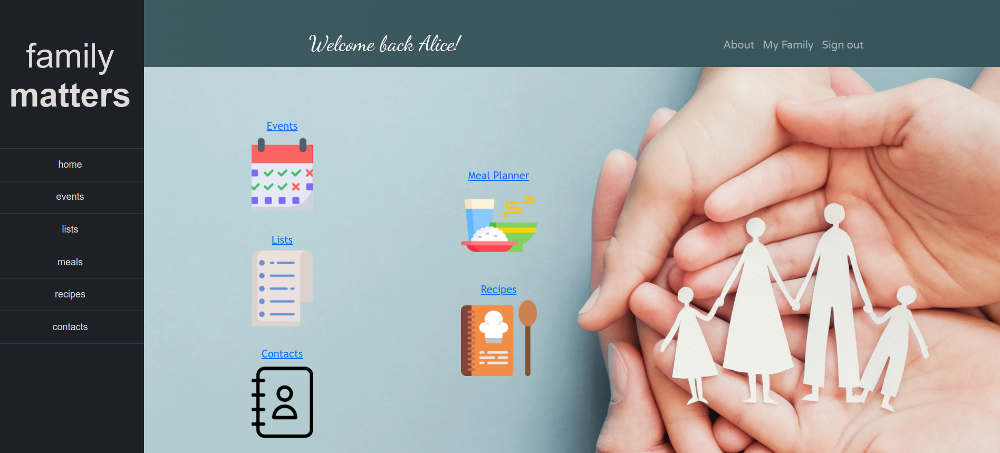
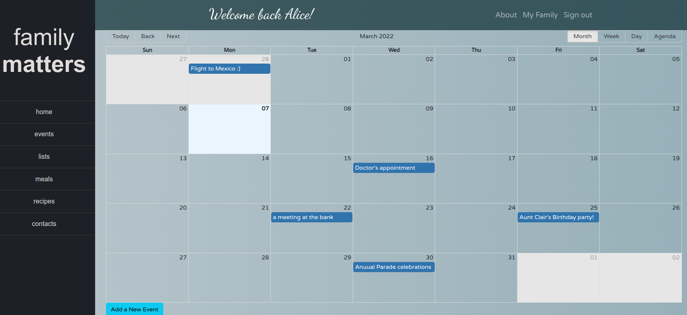
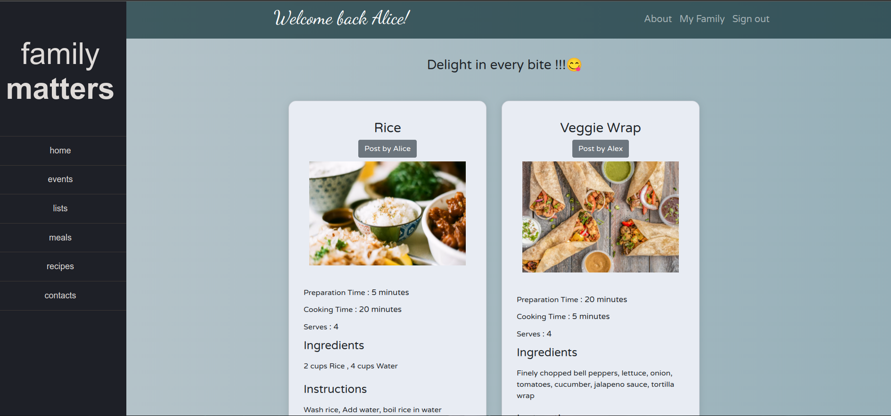
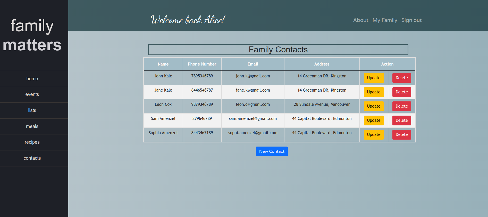
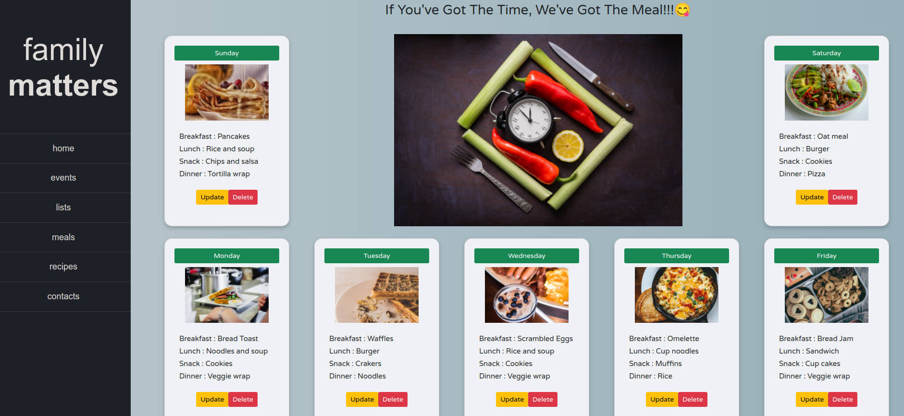

# Family Matters

Family Matters is a project implemented with PERN stack (PostgreSQL, Express, React, Node JS). 
This project allows users to create an account, add family members, create events, lists, recipes, contacts and even to have a weekly meal planner. Each feature allows users to create, update and delete. With the help of this webapp, a family can manage all of their day to day schedules, todos, meals etc all in one place. 

This is a [Lighthouse Labs](https://www.lighthouselabs.ca) project by [Etty Barone](https://github.com/EttyDaniel), [Ayisha Ashraf](https://github.com/ayisha92farishta) and [Akshatha Kulkarni](https://github.com/akshathakulkarni).

Here is a snap shot of the app's view on the browser : 

## Screenshots






## Installation Instructions

1. Install dependencies with `npm install`.
2. Run development server from Server folder 
```sh
npm run local 
```
3. Run developement client from Client folder
```sh
npm start
```
4. To see some preset events/lists/meals we've made, implement the seeds in this repo with psql. 
   Create a local db in psql with the following information :
      username: project
      password: project
      database: final
      (or update .env with your local information)
5. Run db file for creating DB and installing seeds with `npm run db:reset`. 

